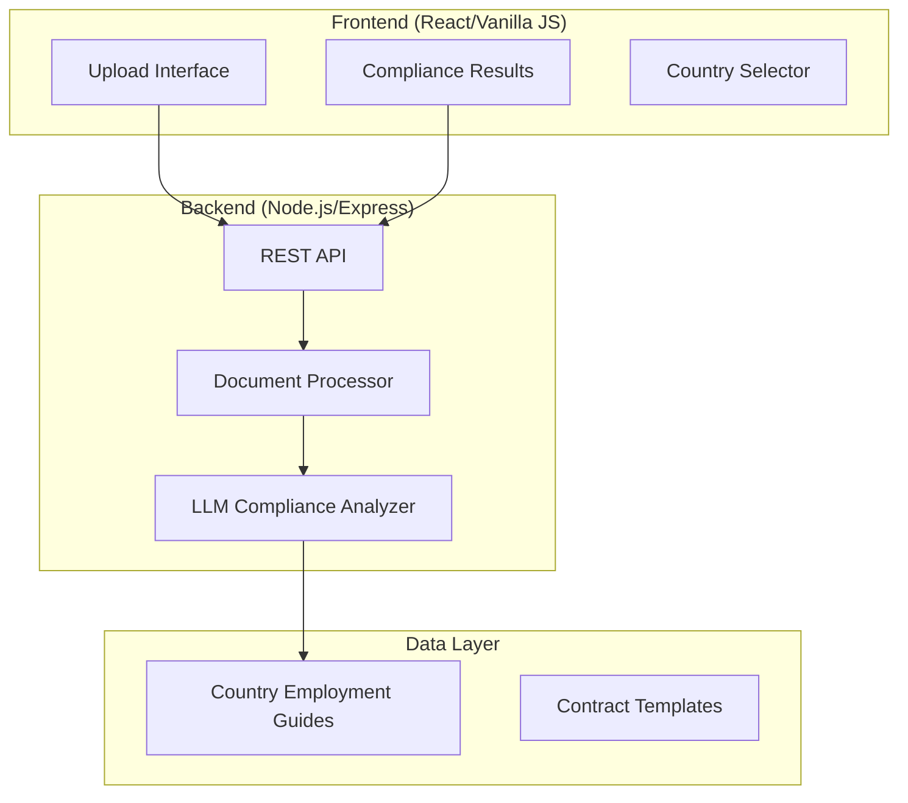

# LLM-Based Document Compliance Service

## Overview

Build a web application that evaluates employment contracts for compliance against country-specific employment regulations using LLM technology. The service will analyze legal documents and identify potential compliance issues.

## Architecture



## Technology Stack

| Layer            | Technology          | Rationale                                       |
| ---------------- | ------------------- | ----------------------------------------------- |
| Frontend         | HTML/CSS/JavaScript | Simple, no build step required                  |
| Backend          | Node.js + Express   | Fast API development, excellent LLM integration |
| LLM              | OpenAI API (GPT-4)  | Best reasoning for legal document analysis      |
| Document Parsing | pdf-parse, mammoth  | Handle PDF and DOCX formats                     |
| Styling          | Vanilla CSS         | Modern, glassmorphic design                     |

---

## Proposed Changes

### 1. Project Structure

#### [NEW] Project Root Structure

```
h:\RemoFirst Assessment\
├── backend/
│   ├── src/
│   │   ├── index.js              # Express server entry
│   │   ├── routes/
│   │   │   └── compliance.js     # API routes
│   │   ├── services/
│   │   │   ├── llmService.js     # LLM integration
│   │   │   └── documentParser.js # Document parsing
│   │   └── data/
│   │       ├── country-guides/   # Employment regulations
│   │       └── sample-contracts/ # Test contracts
│   ├── package.json
│   └── .env.example
├── frontend/
│   ├── index.html
│   ├── styles.css
│   └── app.js
└── README.md
```

---

### 2. Backend Implementation

#### [NEW] [index.js](file:///h:/RemoFirst%20Assessment/backend/src/index.js)

- Express server setup with CORS
- File upload middleware (multer)
- Route mounting

#### [NEW] [compliance.js](file:///h:/RemoFirst%20Assessment/backend/src/routes/compliance.js)

- `POST /api/analyze` - Upload and analyze document
- `GET /api/countries` - List available country guides
- `GET /api/country/:code` - Get specific country regulations

#### [NEW] [llmService.js](file:///h:/RemoFirst%20Assessment/backend/src/services/llmService.js)

- OpenAI API integration
- Prompt engineering for compliance analysis
- Structured output parsing for compliance scores

#### [NEW] [documentParser.js](file:///h:/RemoFirst%20Assessment/backend/src/services/documentParser.js)

- PDF parsing (pdf-parse)
- DOCX parsing (mammoth)
- Plain text extraction

---

### 3. Synthetic Data (Country Employment Guides)

#### [NEW] [usa.json](file:///h:/RemoFirst%20Assessment/backend/src/data/country-guides/usa.json)

Key regulations:

- At-will employment
- Minimum wage: $7.25/hour federal
- Overtime: 1.5x after 40 hours/week
- No mandatory paid vacation (FLSA)
- Anti-discrimination requirements

#### [NEW] [germany.json](file:///h:/RemoFirst%20Assessment/backend/src/data/country-guides/germany.json)

Key regulations:

- Strong termination protection (Kündigungsschutz)
- Minimum 20 days paid vacation
- Maximum 48 hours/week working time
- Works council requirements
- Notice periods based on tenure

#### [NEW] [uk.json](file:///h:/RemoFirst%20Assessment/backend/src/data/country-guides/uk.json)

Key regulations:

- 28 days statutory holiday entitlement
- National Minimum Wage tiers by age
- 48-hour maximum work week (opt-out available)
- Statutory sick pay requirements
- Redundancy pay calculations

---

### 4. Sample Contracts for Testing

#### [NEW] [compliant_us_contract.txt](file:///h:/RemoFirst%20Assessment/backend/src/data/sample-contracts/compliant_us_contract.txt)

- Properly structured US employment agreement

#### [NEW] [non_compliant_germany_contract.txt](file:///h:/RemoFirst%20Assessment/backend/src/data/sample-contracts/non_compliant_germany_contract.txt)

- Contract with intentional violations (e.g., only 10 vacation days)

#### [NEW] [partial_compliant_uk_contract.txt](file:///h:/RemoFirst%20Assessment/backend/src/data/sample-contracts/partial_compliant_uk_contract.txt)

- Mixed compliance status for demonstration

---

### 5. Frontend Implementation

#### [NEW] [index.html](file:///h:/RemoFirst%20Assessment/frontend/index.html)

- Modern, responsive layout
- File upload dropzone
- Country selection dropdown
- Results display area

#### [NEW] [styles.css](file:///h:/RemoFirst%20Assessment/frontend/styles.css)

- Glassmorphic design
- Dark mode theme
- Animated compliance indicators
- Professional legal document feel

#### [NEW] [app.js](file:///h:/RemoFirst%20Assessment/frontend/app.js)

- API integration
- File handling
- Dynamic results rendering
- Error handling

---

## LLM Prompt Engineering Strategy

The compliance analysis will use a structured prompt approach:

```
SYSTEM: You are a legal compliance expert specializing in employment law.
Analyze the provided employment contract against the regulations of {country}.

For each regulation, determine:
1. COMPLIANT - Contract meets requirement
2. NON_COMPLIANT - Contract violates requirement  
3. NOT_ADDRESSED - Contract doesn't mention this aspect
4. UNCLEAR - Ambiguous language, needs clarification

Provide specific line references and explanations.

OUTPUT FORMAT: JSON with compliance scores and detailed findings
```

This approach ensures:

- Consistent, parseable output
- Actionable compliance insights
- Clear reasoning chain for each finding

---

## Verification Plan

### Automated Tests

1. **API Endpoint Tests**
   
   ```bash
   cd h:\RemoFirst Assessment\backend
   npm test
   ```
   
   - Test document upload handling
   - Test country guide retrieval
   - Test error handling

2. **Document Parsing Tests**
   
   - Verify text extraction from PDF/DOCX/TXT
   - Test with sample documents

### Manual Verification

1. **Frontend Testing**
   
   - Open `frontend/index.html` in browser
   - Upload sample contracts
   - Verify compliance results display correctly

2. **End-to-End Flow**
   
   - Start backend: `npm run dev`
   - Open frontend
   - Upload non-compliant contract
   - Verify AI identifies violations correctly

3. **Cross-Country Testing**
   
   - Test same contract against different countries
   - Verify different compliance results

---

## User Review Required

> [!IMPORTANT]
> **OpenAI API Key Required**: You'll need to provide an OpenAI API key for LLM functionality. Set it in `.env` file as `OPENAI_API_KEY=your-key-here`.

> [!NOTE]
> **Alternative LLM Options**: If you prefer, I can implement this using:
> 
> - Local models (Ollama with Llama/Mistral)
> - Azure OpenAI
> - Anthropic Claude API
> 
> Let me know your preference before I proceed.

---

## Estimated Timeline

| Phase                     | Duration     |
| ------------------------- | ------------ |
| Backend Setup             | 30 min       |
| Country Guides Generation | 20 min       |
| Sample Contracts          | 15 min       |
| LLM Integration           | 45 min       |
| Frontend Development      | 40 min       |
| Testing & Polish          | 30 min       |
| **Total**                 | **~3 hours** |
